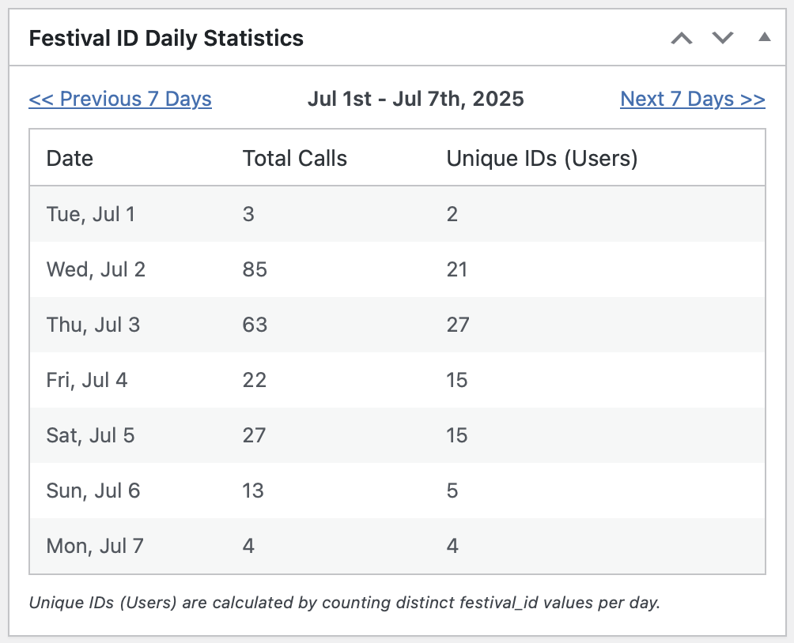
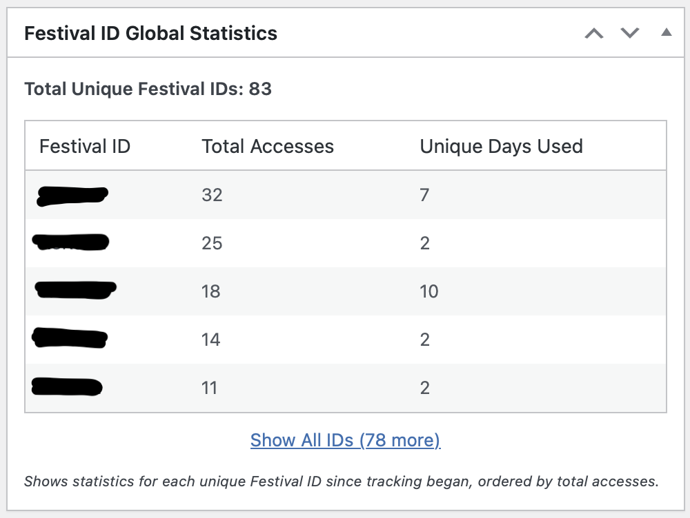
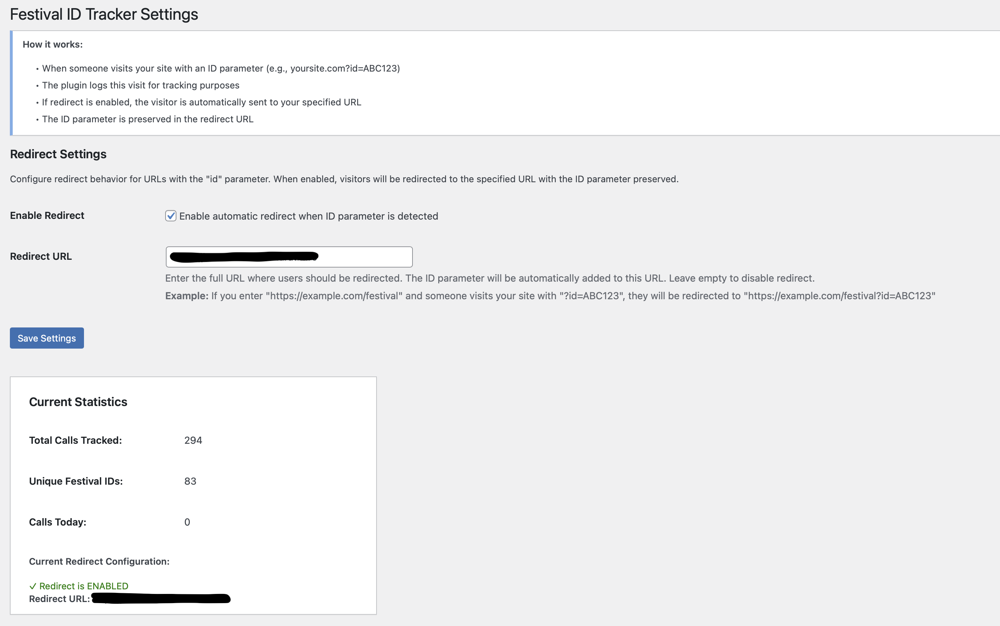

# Festival ID Tracker WordPress Plugin

[](https://www.gnu.org/licenses/gpl-2.0.html)
[](https://wordpress.org/)
[](https://php.net/)

A WordPress plugin to track and report on specific URL calls containing unique 'festival ID' parameters, providing daily and global statistics directly in the dashboard with optional redirect functionality.

## Overview

The **Festival ID Tracker** WordPress Plugin is designed to provide custom, in-dashboard analytics for websites using unique identifiers in their URLs, such as those generated by NFC tags, QR codes, or specific campaign links. It offers a straightforward way to monitor engagement and traffic related to these unique IDs without needing to navigate external analytics platforms.

**Version 1.5.0** introduces enhanced security features, WordPress compliance improvements, and automatic data migration for seamless upgrades.

### Key Highlights
- **Enhanced Security**: Rate limiting, bot detection, and nonce verification
- **Real-time Statistics**: Dashboard widgets with daily and global analytics
- **Smart Redirect**: Automatic redirects while preserving tracking
- **Privacy-Focused**: Daily-rotating hashes instead of storing personal data
- **Performance Optimized**: Intelligent caching for database queries

## Features

### Core Tracking Features
* **Custom URL Parameter Tracking:** Specifically designed to log accesses to URLs containing `?id=XXXXXX` (where `XXXXXX` is a 6-character alphanumeric string)
* **Secure Database Logging:** All tracked calls are stored in a custom WordPress database table with proper indexing
* **Privacy Protection:** Uses daily-rotating hashes for user identification
* **Bot Filtering:** Automatically detects and filters out bot traffic from statistics

### Security Features (New in v1.5.0)
* **Rate Limiting:** Maximum 10 requests per minute per IP address
* **Bot Detection:** Filters out common crawlers and automated traffic
* **Nonce Verification:** All admin operations protected with WordPress nonces
* **SQL Injection Protection:** Prepared statements and proper escaping throughout
* **XSS Prevention:** All output properly escaped

### Dashboard Analytics
* **Daily Statistics Widget:**
    * 7-day rolling window with navigation
    * Total calls and unique IDs per day
    * Historical data browsing with Previous/Next links
    
* **Global Statistics Widget:**
    * All-time performance for each festival ID
    * Total accesses and active days per ID
    * Toggle between top 5 and complete list
    * Sorted by popularity

### Redirect Functionality
* **Automatic Redirect:** Configure automatic redirects for visitors with festival IDs
* **ID Preservation:** Original festival ID parameter maintained in redirect URL
* **Flexible Configuration:** Enable/disable with simple toggle
* **Any Destination:** Works with internal or external URLs

### Administration
* **Settings Page:** Comprehensive configuration under `Settings > Festival ID Tracker`
* **Quick Statistics:** Real-time stats display in settings
* **Plugin Actions:** Direct settings access from plugins page
* **Testing Tools:** Built-in testing instructions and examples

## Installation

### Method 1: Manual Installation 

1. **Download the Plugin:**
   ```bash
   git clone https://github.com/Clustmart/festival-id-tracker-wp-plugin.git
   ```
   Or download the latest release ZIP from the [Releases page](https://github.com/Clustmart/festival-id-tracker-wp-plugin/releases)

2. **Upload to WordPress:**
   - Rename the folder to `festival-id-tracker`
   - Upload to `wp-content/plugins/` directory

3. **Activate Plugin:**
   - Navigate to `Plugins > Installed Plugins` in WordPress admin
   - Click "Activate" for Festival ID Tracker

### Method 2: Via WordPress Admin

1. Download the latest release ZIP file
2. Go to `Plugins > Add New > Upload Plugin` in WordPress admin
3. Select the ZIP file and click "Install Now"
4. Activate the plugin after installation

## Configuration

### Basic Setup (Tracking Only)
The plugin automatically starts tracking `?id=XXXXXX` parameters upon activation. No configuration required for basic tracking.

### Redirect Setup
1. Navigate to `Settings > Festival ID Tracker`
2. Check "Enable automatic redirect when ID parameter is detected"
3. Enter your destination URL
4. Save Settings

### Testing Your Configuration
```
yoursite.com?id=TEST01
```
Visit the above URL (with your domain) to verify:
- Tracking is working (check statistics)
- Redirect functions correctly (if enabled)


## Screens
 
 
 


## Usage Examples

### NFC Tag Campaigns
```
example.com?id=NFC001
→ Tracks tap, redirects to event schedule
```

### QR Code Marketing
```
example.com?id=QRC123
→ Monitors scan, sends to registration page
```

### Social Media Tracking
```
example.com?id=TWT001 (Twitter)
example.com?id=FBK001 (Facebook)
→ Compare platform effectiveness
```

### Multi-Venue Events
```
example.com?id=STAGE1
example.com?id=STAGE2
→ Track venue popularity, provide specific info
```

## Statistics Explained

### Dashboard Widgets

#### Daily Statistics
- **Date**: The specific day
- **Total Calls**: All visits with any festival ID that day
- **Unique IDs**: Number of different festival IDs used

#### Global Statistics
- **Festival ID**: The 6-character identifier
- **Total Accesses**: All-time visits for this ID
- **Unique Days Used**: Number of different days ID was accessed

### Settings Page Statistics
- **Total Calls Tracked**: All-time total visits with IDs
- **Unique Festival IDs**: Count of different IDs ever used
- **Calls Today**: Today's visits with any ID


## Security & Privacy

### Security Measures
- **Rate Limiting**: Prevents abuse (10 req/min/IP)
- **Bot Detection**: Filters automated traffic
- **Input Validation**: All inputs sanitized and validated
- **SQL Protection**: Prepared statements throughout
- **XSS Prevention**: Escaped output
- **CSRF Protection**: Nonce verification on all admin actions

### Privacy Features
- **Hashed Data**: User info hashed daily (IP + User Agent + Daily Salt)
- **No PII Storage**: No personally identifiable information stored long-term
- **GDPR Ready**: Designed with privacy regulations in mind

## Requirements

- **WordPress**: 5.0 or higher
- **PHP**: 7.4 or higher
- **MySQL**: 5.6 or higher

## 🔧 Troubleshooting

### Statistics showing 0?
If "Total Calls" or "Unique IDs" show 0 but "Calls Today" is correct:
1. Caches may need refreshing (expire after 1 hour)
2. Deactivate and reactivate the plugin to clear caches
3. Check database table `wp_festidtrack_log` exists

### Redirect not working?
1. Ensure "Enable Redirect" is checked
2. Verify URL is valid (starts with http:// or https://)
3. Test with `yoursite.com?id=TEST01`
4. Check browser console for errors

## Changelog

### Version 1.5.0 (Latest)
- **SECURITY:** Added comprehensive security improvements
  - Rate limiting (10 requests/minute/IP)
  - Bot detection and filtering
  - Nonce verification for all admin operations
- **COMPLIANCE:** Changed prefix from `fit_` to `festidtrack_` for WordPress standards
- **MIGRATION:** Automatic data migration from previous versions
- **PERFORMANCE:** Improved SQL queries and caching
- **FIXES:** Resolved statistics display issues
- **CODE:** Complete refactoring for WordPress coding standards

### Version 1.4.0
- **NEW:** Redirect functionality with configurable destination URLs
- **NEW:** Comprehensive settings page
- **NEW:** Enable/disable toggle for redirect feature
- **NEW:** Quick statistics display in settings
- **IMPROVED:** Enhanced documentation

### Version 1.3.0
- Dashboard widgets for daily and global statistics
- 7-day rolling navigation for historical data
- Top 5 / Show All toggle for global statistics

### Version 1.0.0
- Initial release
- Basic tracking functionality
- Database logging

## Contributing

We welcome contributions! Please:
1. Fork the repository
2. Create a feature branch (`git checkout -b feature/AmazingFeature`)
3. Commit your changes (`git commit -m 'Add some AmazingFeature'`)
4. Push to the branch (`git push origin feature/AmazingFeature`)
5. Open a Pull Request

## License

This plugin is open-source software licensed under the [GNU General Public License v2.0 or later](https://www.gnu.org/licenses/gpl-2.0.html).

## 👥 Support

For support, feature requests, or bug reports:
- **GitHub Issues**: [Report an issue](https://github.com/Clustmart/festival-id-tracker-wp-plugin/issues)
- **Plugin URI**: https://github.com/Clustmart/festival-id-tracker-wp-plugin
- **Author**: Paul Wasicsek / Digital Travel Guide
- **Author URI**: https://vernissaria.de/

## Use Cases

Perfect for:
- **Festivals & Events**: Track NFC wristbands, QR codes on badges
- **Retail Campaigns**: Monitor in-store QR code engagement
- **Marketing Campaigns**: Track campaign-specific URLs
- **Museums & Exhibitions**: Monitor exhibit interaction via NFC/QR
- **Educational Events**: Track attendance and engagement
- **Tourism & Hospitality**: Monitor tourist information point usage

