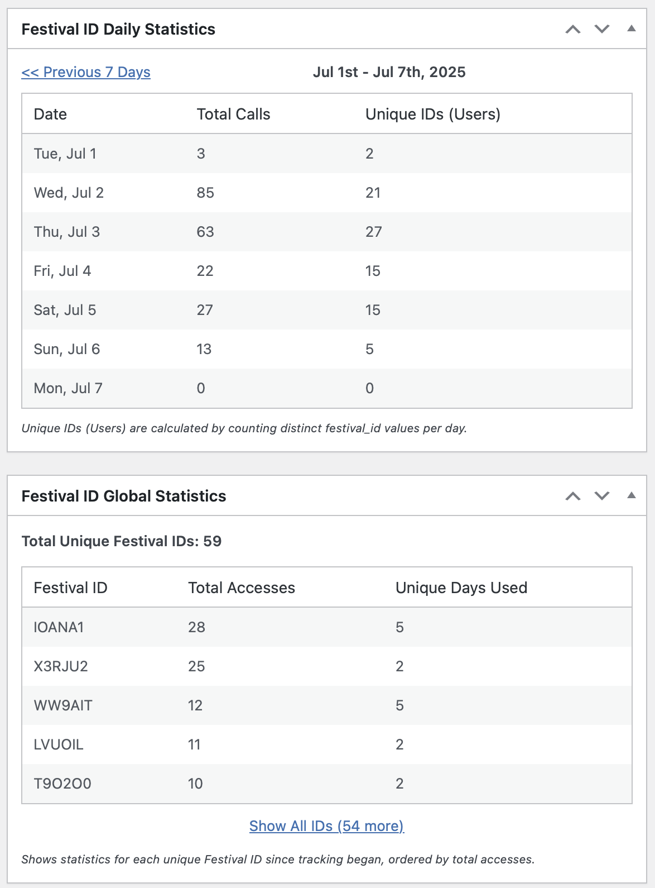

# Use Case: Tracking NFC Tags for "Festivalul Inimilor"

This document details a specific application of the "Festival ID Tracker" WordPress plugin for the 34th edition of "Festivalul Inimilor" in Timișoara, Romania.

## Festivalul Inimilor - A Brief Overview

"Festivalul Inimilor" (Festival of Hearts) is a prestigious international folklore festival originating from Timișoara, Romania. Initiated in 1990 as a tribute to those who perished during the December 1989 Revolution, it has rapidly grown into one of the most significant cultural events in the region. The festival is officially recognized and listed in the CIOFF (International Council of Organizations of Folklore Festivals and Folk Arts) calendar, underscoring its cultural importance and global reach. Now in its 34th edition, the festival continues to evolve, embracing new technologies to enhance the visitor experience.

## The Digital Initiative: NFC-Enabled Brooches

For its 34th edition, "Festivalul Inimilor" is introducing innovative digital possibilities for its visitors. Heart-shaped brooches, each embedded with a unique Near Field Communication (NFC) tag, are being distributed.

When a visitor reads one of these NFC tags with their mobile phone, it automatically directs their browser to a specific URL on the festival's official website, following this format:

`https://festivalul-inimilor.ro?id=XXXXXX`

Where `XXXXXX` represents a unique 6-character alphanumeric code embedded within each individual NFC tag.

## Role of the WordPress Plugin

The `festival-id-tracker-wp-plugin` plays a central role in collecting and analyzing the engagement generated by these NFC tags. When a user accesses the `festivalul-inimilor.ro` website via an NFC-enabled brooch, the plugin:

1.  **Captures the `id` Parameter:** The plugin's core functionality intercepts and extracts the unique `XXXXXX` code from the URL.
2.  **Logs Each Access:** Every time a URL with a recognized `id` parameter is visited, the plugin records this event in a dedicated database table within the WordPress installation. This includes the specific `festival_id`, a timestamp of the access, and user-related (though anonymized for unique counting) information.
3.  **Provides Actionable Statistics:**
    * **Daily Usage Overview:** The "Festival ID Daily Statistics" dashboard widget provides insight into the total number of NFC tag reads each day, along with the count of *unique* NFC tags (and thus, unique users for that day) that accessed the site. This helps organizers understand daily visitor engagement trends via the brooches.
    * **Global Tag Performance:** The "Festival ID Global Statistics" widget offers a comprehensive report on the overall activity of each individual NFC tag. This includes the total number of times each specific tag has been read, and the number of different days it has been used. This is invaluable for identifying the most active brooches/users and understanding long-term engagement patterns.

## Derived Possibilities and Insights

The data collected by this plugin, stemming from the NFC tag interactions, opens up several possibilities for the festival organizers:

* **Measuring Physical-to-Digital Engagement:** Quantify how effectively the physical brooches are driving traffic to the digital platform.
* **Identifying Popular Locations/Activities:** If tags are distributed at specific festival zones, tracking their usage could highlight popular areas.
* **Understanding Visitor Loyalty/Repeated Engagement:** By tracking `Unique Days Used` per `festival_id`, organizers can gauge how many times a single brooch (and likely, the same visitor) re-engages with the digital content over different days of the festival.
* **Optimizing Future Digital Initiatives:** The insights gained can inform strategies for future digital activations and visitor engagement programs.
* **Troubleshooting:** Identifying tags that are not being scanned or tags that are being scanned unusually frequently can aid in troubleshooting distribution or technical issues.

This use case demonstrates how a simple WordPress plugin can bridge physical and digital interactions, providing meaningful data for cultural events like "Festivalul Inimilor."

---
